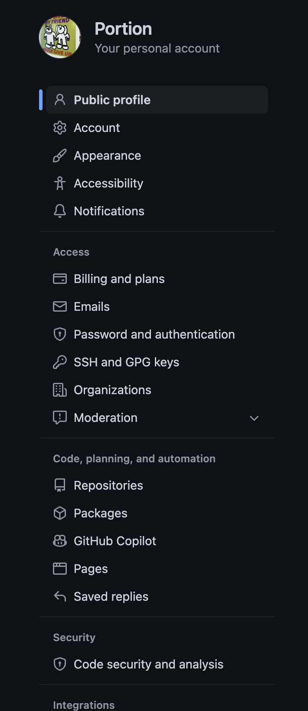
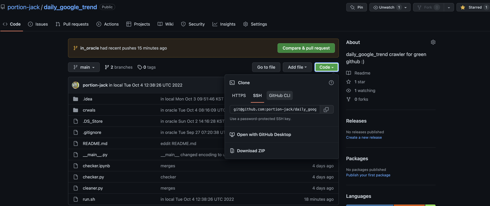

다양한 환경에서 push하기, 
작업하는 환경에 따라서 로컬뿐만 아니라 다양한 환경에서 push하고 싶은 일이 생긴다.
{: .message }

## git config setting
- in oracle

1. cd ~
  - home으로 이동
2. ssh-keygen
  - ssh key를 만들기
  - 1. Enter file in which to save the key (/home/schacon/.ssh/id_rsa):
  -   - 어디만들꺼에용? 그냥 여기?
  - 2. Enter passphrase (empty for no passphrase):
  -   - 비밀번호? 만들까용?
  - Enter same passphrase again:
  -   - 비밀번호 확인!
3. cd .ssh
  - ssh 폴더로 이동~
4. cat id_rsa.pub
  - ssh 폴더에서 id_rsa.pub 읽어주세용~
  - 그럼 결과로 ssh key가 나온다!

## in github
인터넷에서 자기 깃헙으로 들어가기
https://github.com/portion-jack

1. 우측상단의 자기 프로필 클릭!
2. settings를 눌러용~
3. 옵션들이 많은데,
- SSH and GPG 누루기!

4. 초록색 New SSH key 누르기~
5. title은 ex) portion's second mac
- 이런식으로 이건 어디 SSH키였지? 확인하려고 하는거니까 간단히 작성
6. Key라고 되있는곳에 cat id_rsa.pub 에서 본 ssh key를 복사하여 붙여넣어요!

## pushing
1. 이제 ssh-key가 만들어 졌어요
2. 보통 git clone 하실때
- https로 clone 을 하는데 이제는
- ssh에 있는 주소로 clone을 하면 되용
ex ) git clone https://github.com/portion-jack/daily_google_trend.git
-> 이걸 git clone git@github.com:portion-jack/daily_google_trend.git
이런식으로 진행해용
3. 그럼 이것으로 clone하면 github으로 push가 가능해요!

